# RaceIQ Architecture

Visual architecture diagrams for the RaceIQ racing telemetry platform.

## System Overview

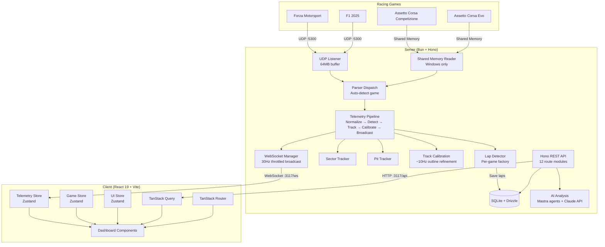

## Telemetry Data Flow

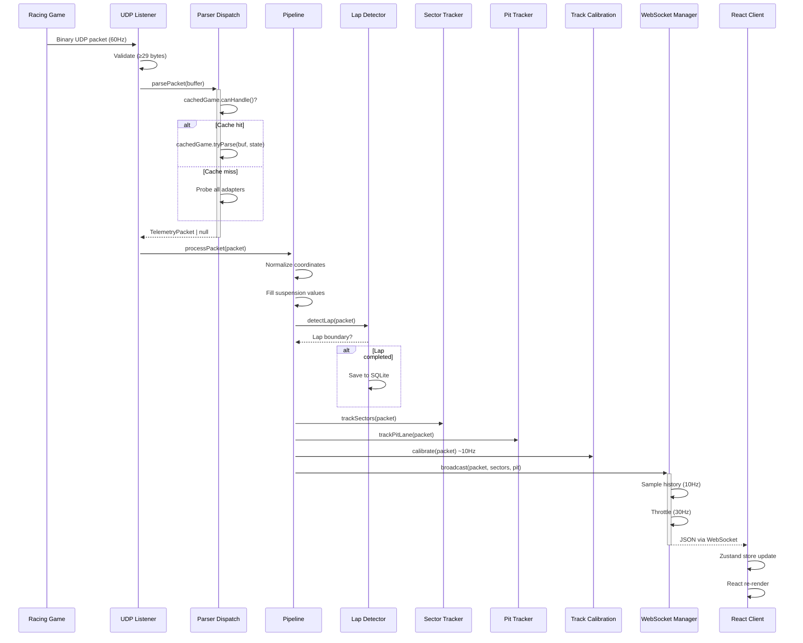

## Data Ingest Pipeline (Detail)

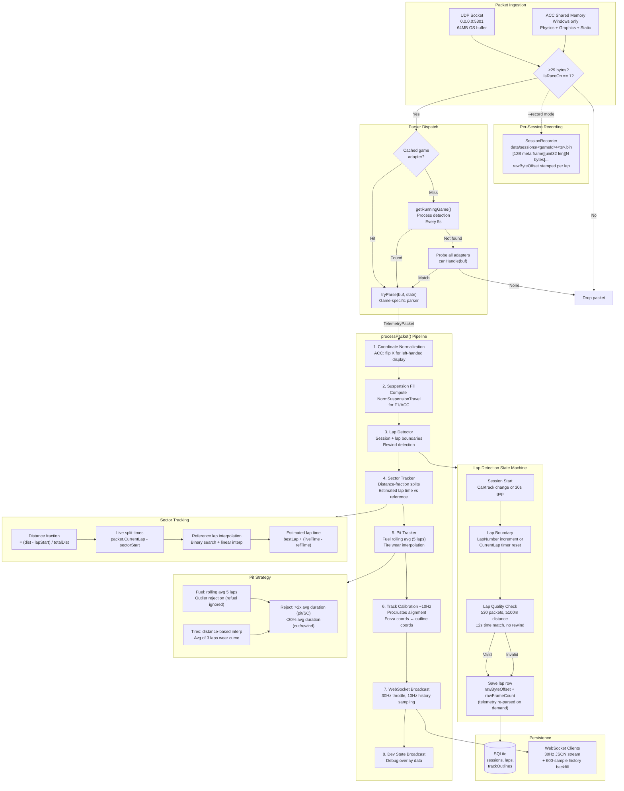

### Pipeline Adapters (Testability)

The pipeline uses dependency injection for DB and WebSocket access:

| Interface | Production | Test |
|-----------|-----------|------|
| `DbAdapter` | `RealDbAdapter` — SQLite queries | `NullDbAdapter`, `CapturingDbAdapter` |
| `WsAdapter` | `RealWsAdapter` — Bun WebSocket manager | `NullWsAdapter`, `CapturingWsAdapter` |

### Pipeline Callbacks

| Event | Trigger | Payload |
|-------|---------|---------|
| `onSessionStart` | Car/track change or 30s silence | `SessionState` |
| `onLapComplete` | Lap boundary crossed | `packets[], lapTime, isValid` |
| `onLapSaved` | Lap persisted to DB | `lapId, lapNumber, lapTime, sectors` |

## Game Adapter Pattern

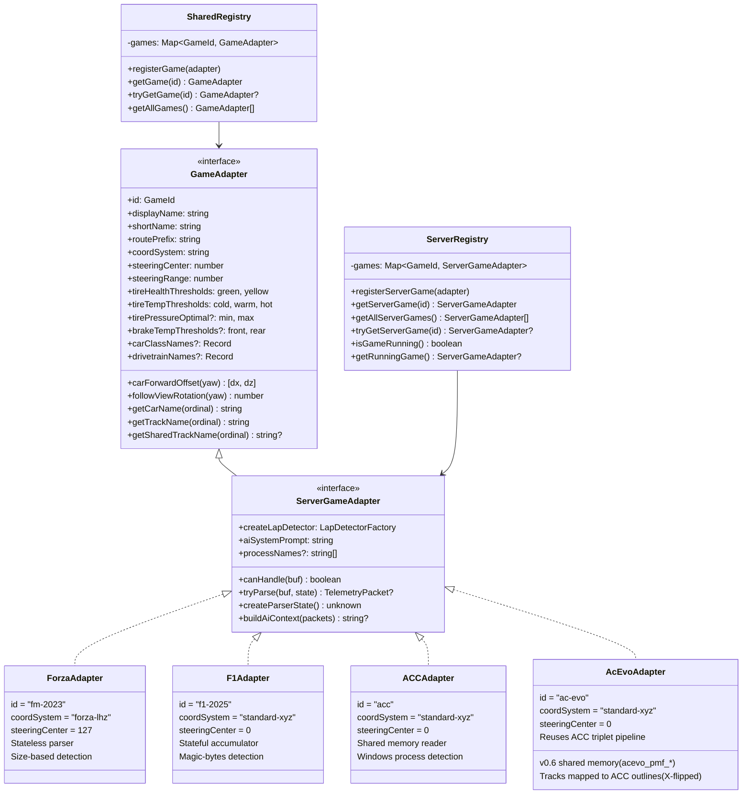

## AI Analysis System

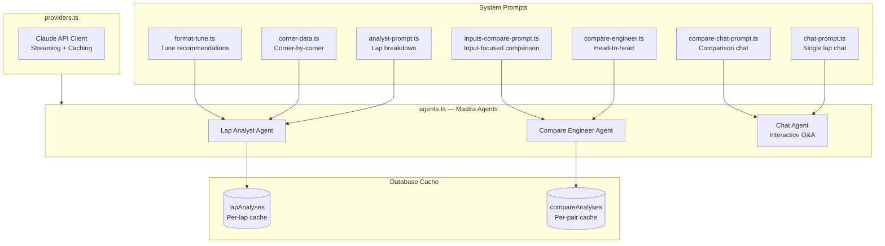

## Database Schema

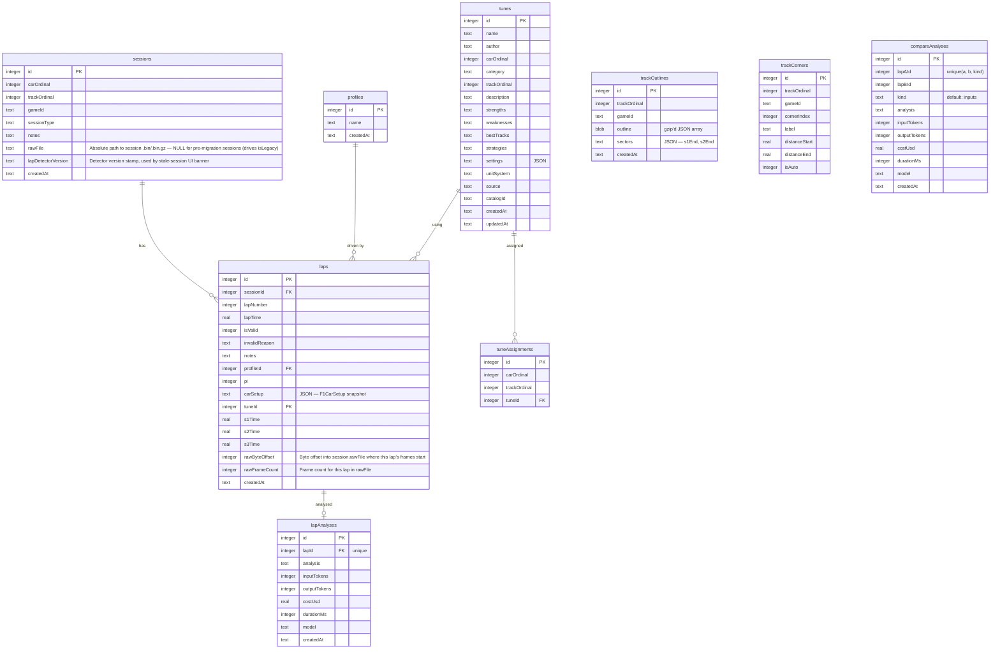

**Legacy-lap derivation (`isLegacy`):** a lap is "legacy" (pre-raw-binary-storage, telemetry unavailable) iff `sessions.raw_file IS NULL`. Migration 19 added `raw_file` + `raw_byte_offset` together, and `Pipeline.onSessionStart` populates `raw_file` before any lap lands — so it's the reliable signal. Per-lap `raw_byte_offset` can be null on a post-migration session (e.g. import-dump path feeds the pipeline without a `rawBuf`, so the recorder stays inactive for that call) and must not be used as the legacy gate.

## Client Architecture

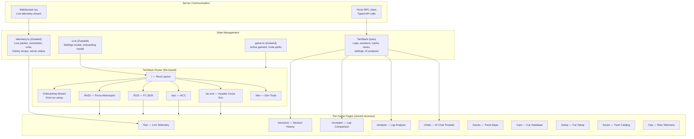

## Server Route Modules

```mermaid
graph LR
    subgraph Routes["routes.ts — Hono App Composition"]
        Laps[lap-routes.ts<br/>Lap CRUD, telemetry, GIF]
        Sessions[session-routes.ts<br/>Session CRUD]
        Tracks[track-routes.ts<br/>Outlines, sectors, corners]
        Cars[car-routes.ts<br/>Car catalog]
        Tunes[tune-routes.ts<br/>Tune management]
        Settings[settings-routes.ts<br/>User preferences]
        ChatsR[chats-routes.ts<br/>AI chat threads]
        ACC[acc-routes.ts<br/>ACC setups, shared memory]
        ACEVOR[ac-evo-routes.ts<br/>AC Evo cars, reader, debug]
        F125R[f125-routes.ts<br/>F1-specific APIs]
        Misc[misc-routes.ts<br/>Export, comparison, status]
        DevR[dev-routes.ts<br/>Debug endpoints, dev only]
    end
```

## Server Startup Sequence

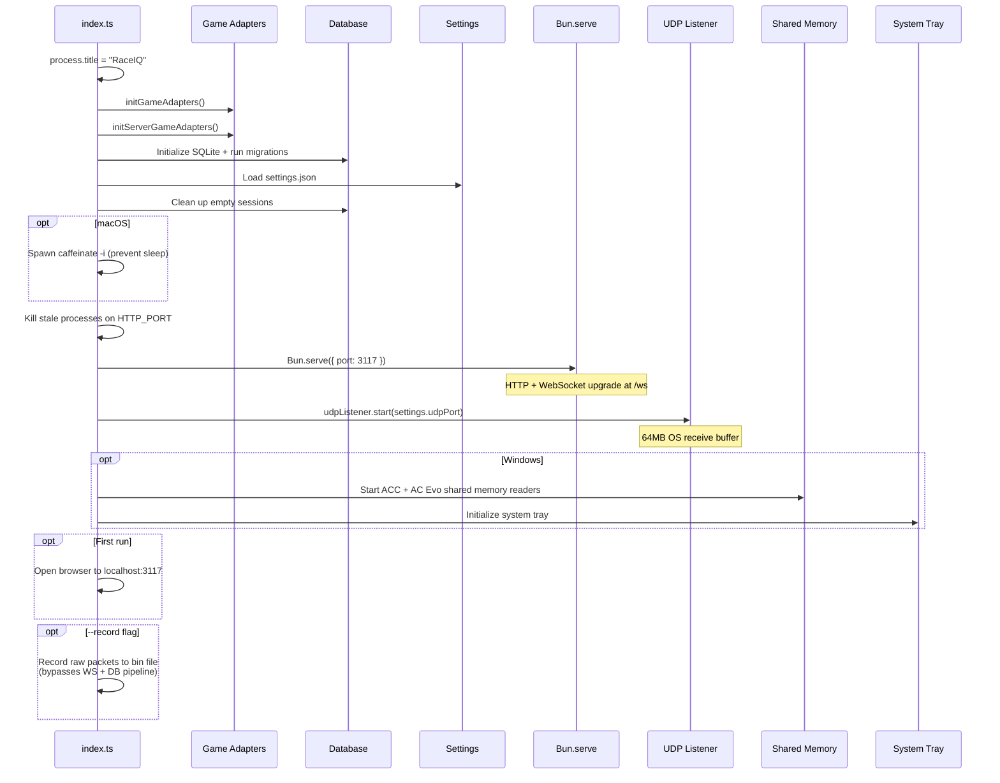

## Parser Dispatch Strategy

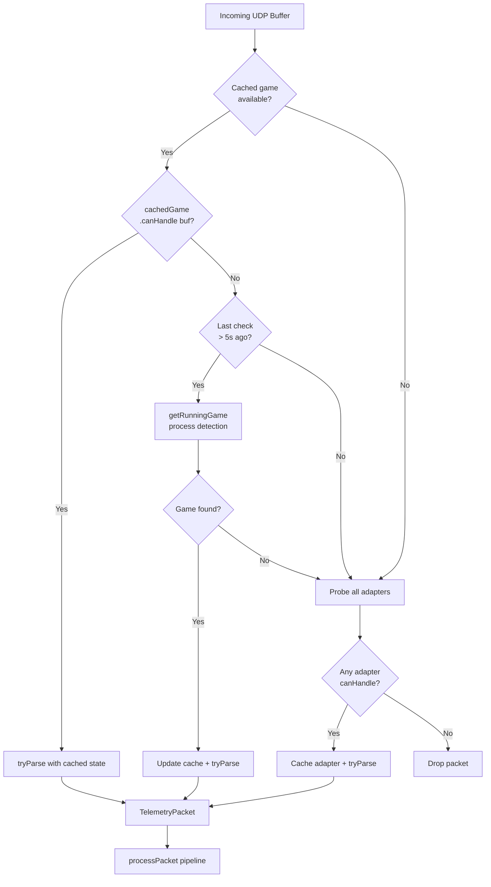

## Comparison Engine

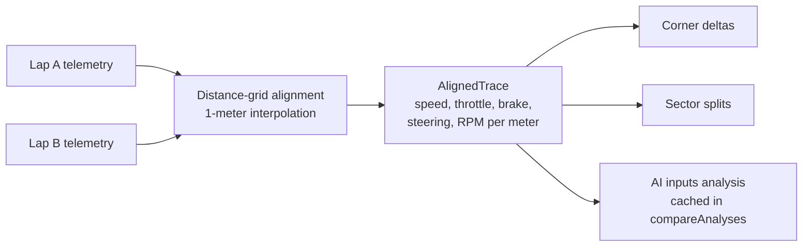

## ACC + AC Evo Adapter Detail

Both games use shared memory on Windows and the same underlying infrastructure.
AC Evo reuses ACC's `BufferedAccMemoryReader`, `TripletAssembler`, and
`TripletPipeline` — only the memory-map names, struct layouts, process name,
and parser differ.

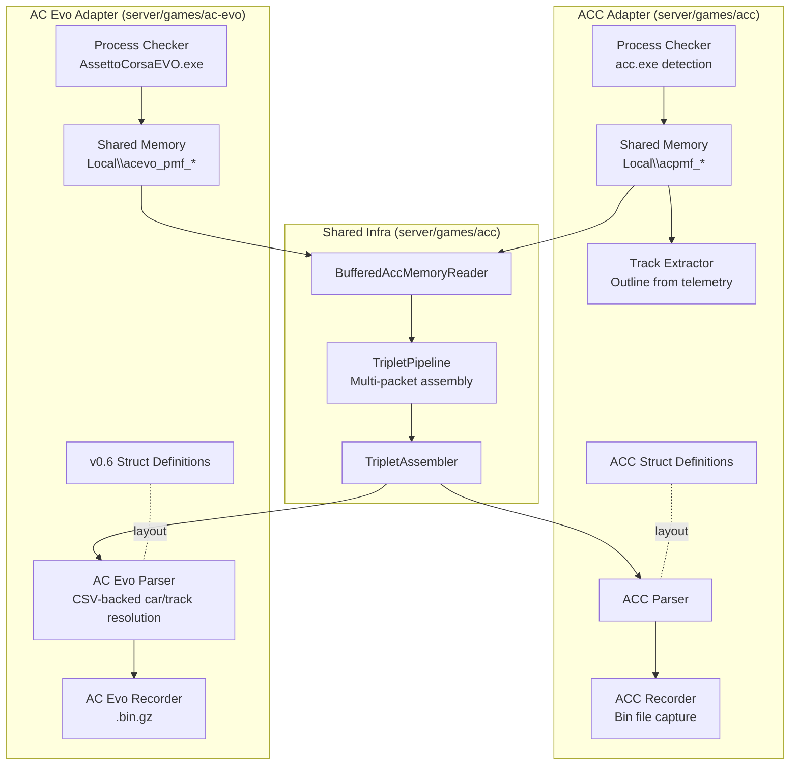
